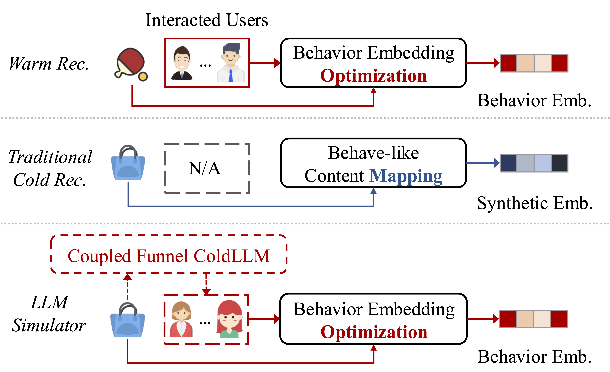

# ColdLLM
This is the source code for our paper "[Large Language Model Simulator for Cold-Start Recommendation](https://arxiv.org/pdf/2402.09176)" in WSDM2025.

---
## Introduction
Recommending cold items remains a significant challenge in billionscale online recommendation systems. While warm items benefit from historical user behaviors, cold items rely solely on content features, limiting their recommendation performance and impacting user experience and revenue. Current models generate synthetic behavioral embeddings from content features but fail to address the core issue: the absence of historical behavior data. To tackle this, we introduce the **LLM Simulator** framework, which leverages large language models to simulate user interactions for cold items, fundamentally addressing the cold-start problem. However, simply using LLM to traverse all users can introduce significant complexity in billion-scale systems. To manage the computational complexity, we propose a **coupled funnel ColdLLM** framework for online recommendation. ColdLLM efficiently reduces the number of candidate users from billions to hundreds using a trained coupled filter, allowing the LLM to operate efficiently and effectively on the filtered set.

---
 
## Environment Preparation

- **GPU:** NVIDIA A800
- **Dependencies from GitHub:**
  - `Llama2-7b`
  - `Llama-Factory`
  - `Chinese-LLaMA-Alpaca`
  - Official libraries for models like `LightGCN`, etc.
- **Data Processing:**
  - Division of cold and hot data
    - LLM-SFT
- Follow the tutorial to:
  - Download model parameters for Llama (the paper uses parameters model for llama7b)
  - Construct SFT training data based on different datasets
    - Execute command XXX to generate corresponding SFT training set for cold items for training
    - Perform parameter merge
    - Save the model

---
## Model File Structure
### Overall Framework
- Filtering: include SubTower model
- Refining: include prompt construct and ask LLM for the answer
- Updating: include recommendation model train

### Refining
- `Llama-SubTower`
- `CollaborativeTower`

### Filtering
- Construct datasets for cold items
- Refine interaction with prompts
- Obtain the final interaction CSV file

### Updating
- Following models like LightGCN, NGCF, etc., shuffle generated interactions with existing interactions for training
- Obtain the final recommendation cold start embedding.

